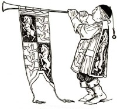

.. blinker_herald documentation master file, created by
   sphinx-quickstart on Tue Jul  9 22:26:36 2013.
   You can adapt this file completely to your liking, but it should at least
   contain the root `toctree` directive.

Welcome to Blinker Herald's documentation!
======================================

The Blinker Herald includes helpers to easily emit signals using the excelent
`blinker`_ library.

Decorate a function or method with :code:`@blinker_herald.emit()`
and **pre** and **post** signals will be automatically emitted to
all connected handlers.

Contents:

.. toctree::
   :maxdepth: 2

   readme
   installation
   contributing
   authors
   history

Indices and tables
==================

* :ref:`genindex`
* :ref:`modindex`
* :ref:`search`

.. _blinker: http://pypi.python.org/pypi/blinker
